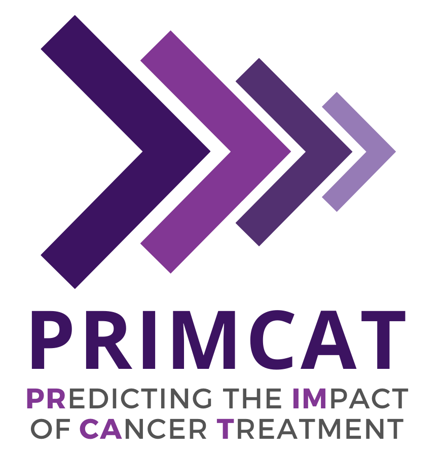

 <br>
This repository contains the R code associated with our manuscript https://doi.org/10.1016/j.jval.2024.06.006 and is part of the <a href="https://mdhs.unimelb.edu.au/centre-for-cancer-research/flagships/primcat-predicting-the-population-health-economic-impact-of-current-and-new-cancer-treatments" target="_blank">PRIMCAT research programme.</a>

### Predicting the Population Health Economic Impact of Current and New Cancer Treatments for Colorectal Cancer: A Data-Driven Whole Disease Simulation Model for Predicting the Number of Patients with Colorectal Cancer by Stage and Treatment Line in Australia.


------------------------------------------------------------------------

#### 📖 Abstract

**Objectives**: Effective healthcare planning, resource allocation, and budgeting require accurate predictions of the number of patients needing treatment at specific cancer stages and treatment lines. The Predicting the Population Health Economic Impact of Current and New Cancer Treatments (PRIMCAT) for Colorectal Cancer (CRC) simulation model (PRIMCAT-CRC) was developed to meet this requirement for all CRC stages and relevant molecular profiles in Australia.

**Methods**: Real-world data were used to estimate treatment utilization and time-to-event distributions. This populated a discrete-event simulation, projecting the number of patients receiving treatment across all disease stages and treatment lines for CRC and forecasting the number of patients likely to utilize future treatments. Illustrative analyses were undertaken, estimating treatments across disease stages and treatment lines over a 5-year period (2022-2026). We demonstrated the model s applicability through a case study introducing pembrolizumab as a first-line treatment for mismatch-repair-deficient stage IV.

**Results**: Clinical registry data from 7163 patients informed the model. The model forecasts 15 738 incident and 2821 prevalent cases requiring treatment in 2022, rising to 15 921 and 2871, respectively, by 2026. Projections show that over 2022 to 2026, there will be a total of 116 752 treatments initiated, with 43% intended for stage IV disease. The introduction of pembrolizumab is projected for 706 patients annually, totaling 3530 individuals starting treatment with pembrolizumab over the forecasted period, without significantly altering downstream utilization of subsequent treatments.

**Conclusion**: PRIMCAT-CRC is a versatile tool that can be used to estimate the eligible patient populations for novel cancer therapies, thereby reducing
uncertainty for policymakers in decisions to publicly reimburse new treatments.   

------------------------------------------------------------------------

#### 🔍 Repository content

``` bash
├─ Input                               # Input files required to run PRIMCAT-CRC
│  ├─ AIHW_CRC_Incidence.xlsx          # Incidence CRC in Australia 2010-2021
│  ├─ CVDL_CRC_StageDistribution.xlsx  # Stage distribution CRC from CVDL 2010-2019
│  ├─ pars_deterministic.RDS           # Estimated Parameters from ACCORD & TRACC analyses
│  └─ DES_function.R                   # R script with DES functions 
│
├─ Script
│  ├─ 1_PRIMCAT_CRC_function.R         # R script defining the PRIMCAT-CRC model
│  ├─ 2_model_validation.R             # R script used for model validation
│  ├─ 3_base_case.R                    # Base case scenario analysis
│  └─ 4_scenario_pembro.R              # Scenario analysis for Pembrolizumab introduction
│
├─ PRIMCAT-logo-small.jpg
├─ LICENCE
└─ README.md
```

------------------------------------------------------------------------
